# Agent→Skill Dependency Graph

## Summary Statistics

- **Total Agents**: 14
- **Unique Skills Referenced**: 20
- **Total Skill References**: 28
- **Avg Skills per Agent**: 2.0

## Agent Dependencies

| Agent | Skills Referenced | Count |
|-------|-------------------|-------|
| agent-creator |  | 0 |
| architecture-decision-orchestrator |  | 0 |
| cloud-aws-orchestrator |  | 0 |
| cloud-native-orchestrator |  | 0 |
| compliance-orchestrator | compliance-oscal-validator | 1 |
| cost-optimization-orchestrator | finops-cost-analyzer | 1 |
| database-migration-orchestrator | data-pipeline-designer, database-optimization-analyzer, testing-strategy-composer | 3 |
| devops-pipeline-orchestrator | devops-cicd-generator, devops-deployment-designer, devops-iac-generator, ... (+1 more) | 4 |
| disaster-recovery-orchestrator |  | 0 |
| incident-response-orchestrator |  | 0 |
| multi-region-orchestrator | cloud-kubernetes-integrator, cloud-multicloud-advisor, database-optimization-analyzer, ... (+3 more) | 6 |
| observability-orchestrator | observability-stack-configurator | 1 |
| performance-orchestrator | cloud-edge-architect, container-image-optimizer, database-optimization-analyzer, ... (+2 more) | 5 |
| security-auditor | security-cloud-analyzer, security-container-validator, security-crypto-validator, ... (+4 more) | 7 |

## Skill Usage by Agents

| Skill | Used By Agents | Count |
|-------|----------------|-------|
| database-optimization-analyzer | database-migration-orchestrator, multi-region-orchestrator, ... (+1 more) | 3 |
| observability-stack-configurator | devops-pipeline-orchestrator, observability-orchestrator, ... (+1 more) | 3 |
| finops-cost-analyzer | cost-optimization-orchestrator, performance-orchestrator | 2 |
| devops-deployment-designer | devops-pipeline-orchestrator, multi-region-orchestrator | 2 |
| devops-iac-generator | devops-pipeline-orchestrator, multi-region-orchestrator | 2 |
| security-network-validator | multi-region-orchestrator, security-auditor | 2 |
| compliance-oscal-validator | compliance-orchestrator | 1 |
| data-pipeline-designer | database-migration-orchestrator | 1 |
| testing-strategy-composer | database-migration-orchestrator | 1 |
| devops-cicd-generator | devops-pipeline-orchestrator | 1 |
| cloud-kubernetes-integrator | multi-region-orchestrator | 1 |
| cloud-multicloud-advisor | multi-region-orchestrator | 1 |
| cloud-edge-architect | performance-orchestrator | 1 |
| container-image-optimizer | performance-orchestrator | 1 |
| security-cloud-analyzer | security-auditor | 1 |
| security-container-validator | security-auditor | 1 |
| security-crypto-validator | security-auditor | 1 |
| security-iam-reviewer | security-auditor | 1 |
| security-os-validator | security-auditor | 1 |
| security-zerotrust-assessor | security-auditor | 1 |

## Insights

### Orphaned Skills (41)

Skills not referenced by any agent (directly user-invoked or routing-based):

- `api-contract-testing`
- `api-design-validator`
- `api-graphql-designer`
- `architecture-decision-framework`
- `cloud-aws-architect`
- `cloud-serverless-designer`
- `compliance-automation-engine`
- `compliance-fedramp-validator`
- `core-agent-authoring`
- `core-codex-delegator`
- `core-gemini-delegator`
- `core-skill-authoring`
- `database-migration-generator`
- `devops-drift-detector`
- `documentation-content-generator`
- `e2e-testing-generator`
- `frontend-designsystem-validator`
- `frontend-framework-advisor`
- `go-project-scaffolder`
- `integration-messagequeue-designer`
- ... and 21 more

### Heavily Referenced Skills (6)

Skills used by multiple agents:

- **database-optimization-analyzer** (3 agents): database-migration-orchestrator, multi-region-orchestrator, performance-orchestrator
- **observability-stack-configurator** (3 agents): devops-pipeline-orchestrator, observability-orchestrator, performance-orchestrator
- **finops-cost-analyzer** (2 agents): cost-optimization-orchestrator, performance-orchestrator
- **devops-deployment-designer** (2 agents): devops-pipeline-orchestrator, multi-region-orchestrator
- **devops-iac-generator** (2 agents): devops-pipeline-orchestrator, multi-region-orchestrator
- **security-network-validator** (2 agents): multi-region-orchestrator, security-auditor

### Agents with No Skill Dependencies (6)

- `agent-creator`
- `architecture-decision-orchestrator`
- `cloud-aws-orchestrator`
- `cloud-native-orchestrator`
- `disaster-recovery-orchestrator`
- `incident-response-orchestrator`

## Dependency Graph Visualization

```mermaid
graph LR
  classDef agent fill:#e1f5ff,stroke:#01579b,stroke-width:2px
  classDef skill fill:#fff3e0,stroke:#e65100,stroke-width:1px

  agent_creator[Agent Creator]:::agent
  architecture_decision_orchestrator[Architecture Decision Orchestrator]:::agent
  cloud_aws_orchestrator[AWS Cloud Architect]:::agent
  cloud_native_orchestrator[Cloud-Native Deployment Orchestrator]:::agent
  compliance_orchestrator[Compliance Orchestrator]:::agent
  cost_optimization_orchestrator[Cost Optimization Orchestrator]:::agent
  database_migration_orchestrator[Database Migration Orchestrator]:::agent
  devops_pipeline_orchestrator[DevOps Pipeline Orchestrator]:::agent
  disaster_recovery_orchestrator[Disaster Recovery Orchestrator]:::agent
  incident_response_orchestrator[Incident Response Orchestrator]:::agent
  multi_region_orchestrator[Multi-Region Deployment Orchestrator]:::agent
  observability_orchestrator[Observability Orchestrator]:::agent
  performance_orchestrator[Performance Orchestrator]:::agent
  security_auditor[Security Auditor]:::agent

  cloud_edge_architect[cloud-edge-architect]:::skill
  cloud_kubernetes_integrator[cloud-kubernetes-integrator]:::skill
  cloud_multicloud_advisor[cloud-multicloud-advisor]:::skill
  compliance_oscal_validator[compliance-oscal-validator]:::skill
  container_image_optimizer[container-image-optimizer]:::skill
  data_pipeline_designer[data-pipeline-designer]:::skill
  database_optimization_analyzer[database-optimization-analyzer]:::skill
  devops_cicd_generator[devops-cicd-generator]:::skill
  devops_deployment_designer[devops-deployment-designer]:::skill
  devops_iac_generator[devops-iac-generator]:::skill
  finops_cost_analyzer[finops-cost-analyzer]:::skill
  observability_stack_configurator[observability-stack-configurator]:::skill
  security_cloud_analyzer[security-cloud-analyzer]:::skill
  security_container_validator[security-container-validator]:::skill
  security_crypto_validator[security-crypto-validator]:::skill
  security_iam_reviewer[security-iam-reviewer]:::skill
  security_network_validator[security-network-validator]:::skill
  security_os_validator[security-os-validator]:::skill
  security_zerotrust_assessor[security-zerotrust-assessor]:::skill
  testing_strategy_composer[testing-strategy-composer]:::skill

  compliance_orchestrator --> compliance_oscal_validator
  cost_optimization_orchestrator --> finops_cost_analyzer
  database_migration_orchestrator --> data_pipeline_designer
  database_migration_orchestrator --> database_optimization_analyzer
  database_migration_orchestrator --> testing_strategy_composer
  devops_pipeline_orchestrator --> devops_cicd_generator
  devops_pipeline_orchestrator --> devops_deployment_designer
  devops_pipeline_orchestrator --> devops_iac_generator
  devops_pipeline_orchestrator --> observability_stack_configurator
  multi_region_orchestrator --> cloud_kubernetes_integrator
  multi_region_orchestrator --> cloud_multicloud_advisor
  multi_region_orchestrator --> database_optimization_analyzer
  multi_region_orchestrator --> devops_deployment_designer
  multi_region_orchestrator --> devops_iac_generator
  multi_region_orchestrator --> security_network_validator
  observability_orchestrator --> observability_stack_configurator
  performance_orchestrator --> cloud_edge_architect
  performance_orchestrator --> container_image_optimizer
  performance_orchestrator --> database_optimization_analyzer
  performance_orchestrator --> finops_cost_analyzer
  performance_orchestrator --> observability_stack_configurator
  security_auditor --> security_cloud_analyzer
  security_auditor --> security_container_validator
  security_auditor --> security_crypto_validator
  security_auditor --> security_iam_reviewer
  security_auditor --> security_network_validator
  security_auditor --> security_os_validator
  security_auditor --> security_zerotrust_assessor
```

