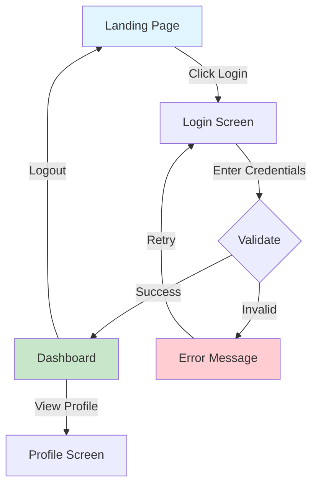

## Purpose & When-To-Use

Use this skill when you need to:
- Translate user stories into visual wireframes and user flows
- Design the structure and navigation of a new application or feature
- Communicate interaction patterns to developers and stakeholders
- Plan responsive layouts for multi-device experiences
- Validate UX design against accessibility standards

**Skip this skill** if you need high-fidelity visual design (use a design tool like Figma) or interactive prototypes (use `frontend-framework-advisor` for code-based prototypes).

## Pre-Checks

1. **Verify time context**: Compute `NOW_ET` = 2025-10-26T12:00:00-04:00 (accessed via NIST/time.gov semantics)
2. **Validate inputs**:
   - User stories are clear with actor, action, and goal
   - Target platform specified (defaults to responsive web)
   - Fidelity level matches project stage (low for discovery, medium for development)
3. **Check design standards** (accessed NOW_ET):
   - WCAG 2.1 AA guidelines (https://www.w3.org/WAI/WCAG21/quickref/, accessed 2025-10-26)
   - Nielsen Norman Group UX heuristics (https://www.nngroup.com/, accessed 2025-10-26)
   - Material Design or Human Interface Guidelines (platform-specific)

## Procedure

### T1: Fast Path (≤2k tokens) - Simple Wireframe

For single-screen layouts or basic user flows (3-5 screens):

1. **Screen inventory** (150 tokens):
   - List screens/views from user stories
   - Identify primary actions per screen
   - Note navigation paths

2. **Layout wireframe** (300 tokens):
   - Define page regions (header, content, sidebar, footer)
   - Place primary UI components (buttons, forms, lists)
   - Label interactive elements

3. **User flow diagram** (250 tokens):
   - Map screen transitions
   - Show decision points (if/else logic)
   - Indicate success and error paths

4. **Basic annotations** (100 tokens):
   - Component labels (e.g., "Primary CTA Button")
   - Interaction notes (e.g., "Click to expand")
   - Navigation indicators

5. **Output** (≤1.2k tokens):
   - Mermaid flowchart for user flow
   - ASCII or simple SVG wireframe
   - Component list with descriptions

### T2: Standard Path (≤6k tokens) - Multi-Screen Mockup

For complex flows with 5-15 screens and responsive requirements:

1. **All T1 steps** (800 tokens)

2. **Responsive layouts** (800 tokens):
   - Define breakpoints (mobile: 320-480px, tablet: 481-1024px, desktop: 1025px+)
   - Show layout variations per breakpoint
   - Document stacking order and hidden elements

3. **Component specifications** (1k tokens):
   - Input fields with validation states (default, focus, error, success)
   - Button states (default, hover, active, disabled)
   - Loading and empty states
   - Modal and overlay behaviors

4. **Accessibility markup** (600 tokens):
   - ARIA labels for screen readers
   - Keyboard navigation order (tab index)
   - Color contrast ratios (4.5:1 for text, 3:1 for UI)
   - Focus indicators and skip links

5. **Interaction specifications** (1k tokens):
   - User actions and system responses
   - State transitions (idle → loading → success/error)
   - Animation timing (subtle, 200-300ms)
   - Error handling and recovery flows

6. **Documentation** (≤2.8k tokens):
   - Complete user flow with annotations
   - Responsive wireframes for 3 breakpoints
   - Accessibility checklist
   - Component interaction table

### T3: Deep Dive (≤12k tokens) - Full Interactive Prototype Spec

For large applications requiring detailed interaction design and user research validation:

1. **All T2 steps** (≤6k tokens)

2. **Advanced interactions** (1.5k tokens):
   - Gesture support (swipe, pinch, long-press for mobile)
   - Drag-and-drop specifications
   - Multi-step form flows with progress indicators
   - Real-time updates and optimistic UI patterns

3. **Micro-interactions** (1k tokens):
   - Hover effects and transitions
   - Loading skeletons and placeholders
   - Toast notifications and alerts
   - Contextual help and tooltips

4. **User research integration** (800 tokens):
   - Usability testing scenarios
   - A/B testing variations
   - Analytics instrumentation points
   - Heatmap and session replay considerations

5. **Design system integration** (1k tokens):
   - Component mapping to existing design system
   - New component specifications if needed
   - Typography scale and spacing system
   - Color palette and semantic tokens

6. **Comprehensive documentation** (≤2.7k tokens):
   - Full interactive prototype specification
   - User flow with 15+ screens
   - Accessibility compliance report
   - Developer handoff notes with edge cases

## Decision Rules

**When to escalate complexity tier:**
- T1 → T2: More than 5 screens, OR responsive design required, OR accessibility compliance mandatory
- T2 → T3: More than 15 screens, OR complex interactions (drag-drop, gestures), OR integration with existing design system

**Fidelity level selection:**
- **Low-fidelity (wireframe):** Discovery phase, rapid iteration, stakeholder alignment
- **Medium-fidelity (mockup):** Development-ready specs, detailed component behavior
- **High-fidelity (prototype):** User testing, stakeholder demos, marketing materials (skip this skill, use design tools)

**When to abort:**
- User stories are too vague (missing actor/action/goal) → request clarification
- Conflicting requirements (e.g., "simple" and "feature-rich") → document trade-offs
- Platform not supported → emit TODO: "Add support for [platform]"

## Output Contract

**Required fields:**
```yaml
wireframe_diagrams: string  # Mermaid flowchart or ASCII/SVG wireframes
interaction_spec: object  # Component behaviors and state transitions
screen_list: array  # Ordered list of screens with descriptions
```

**Optional fields:**
```yaml
responsive_layouts: object  # Breakpoint-specific wireframes
accessibility_notes: array  # WCAG compliance checklist
design_system_components: array  # Mapped or new components
user_flow_diagram: string  # Mermaid flowchart
```

**Format:** Markdown document with embedded diagrams, or JSON/YAML with diagram references

## Examples



```markdown
## Login Screen Wireframe
+----------------------------------+
| [Logo]          [Help] [Sign Up] |
+----------------------------------+
|        Welcome Back!             |
|                                  |
|  Email    [..................]   |
|  Password [..................] 👁 |
|                                  |
|  [ ] Remember me  [Forgot?]      |
|  [    Login    ]                 |
+----------------------------------+

Interactions:
- Email/password fields validate on blur, show inline errors
- Eye icon toggles password visibility
- Login button disabled until valid input, shows spinner on click
```

## Quality Gates

**Token budgets:**
- T1: ≤2k tokens (simple flows, 3-5 screens)
- T2: ≤6k tokens (responsive mockups, accessibility)
- T3: ≤12k tokens (interactive prototypes, design systems)

**Safety checks:**
- [ ] No personal data or real user information in examples
- [ ] Accessibility notes include WCAG 2.1 AA requirements
- [ ] All interactive elements have focus states documented
- [ ] Error states and recovery flows included

**Validation:**
- [ ] User flows have clear start and end states
- [ ] All screens are reachable from navigation
- [ ] Responsive layouts specify breakpoint behavior
- [ ] Component states cover default, hover, active, disabled, error

**Determinism:**
- Use Mermaid for flowcharts (consistent rendering)
- Define exact pixel breakpoints (not "small/medium/large")
- Specify color contrast ratios numerically

## Resources

**UX Best Practices** (accessed 2025-10-26):
- Nielsen Norman Group: https://www.nngroup.com/articles/wireflows/
- Wireframing Guide: https://www.usability.gov/how-to-and-tools/methods/wireframing.html
- User Flow Patterns: https://www.uxpin.com/studio/blog/creating-perfect-user-flows/

**Accessibility Standards** (accessed 2025-10-26):
- WCAG 2.1 Quick Reference: https://www.w3.org/WAI/WCAG21/quickref/
- ARIA Authoring Practices: https://www.w3.org/WAI/ARIA/apg/
- Color Contrast Checker: https://webaim.org/resources/contrastchecker/

**Platform Guidelines** (accessed 2025-10-26):
- Material Design 3: https://m3.material.io/
- Apple Human Interface: https://developer.apple.com/design/human-interface-guidelines/
- Microsoft Fluent 2: https://fluent2.microsoft.design/

**Tools:**
- Mermaid diagrams: https://mermaid.js.org/
- Figma (high-fidelity): https://www.figma.com/
- Wireframe.cc (simple wireframes): https://wireframe.cc/

**Related Skills:**
- `frontend-designsystem-validator` - Validate against existing design systems
- `frontend-framework-advisor` - Recommend framework for implementation
- `testing-unit-generator` - Generate tests for component interactions
